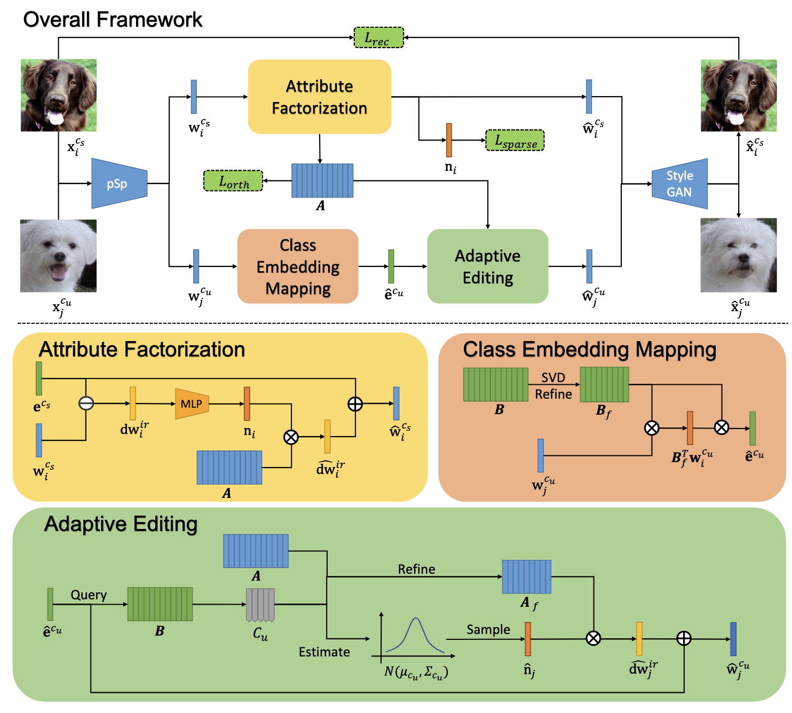

# Stable Attribute Group Editing for Reliable Few-shot Image Generation
<a href="https://opensource.org/licenses/MIT"></a>  

<p align="center">

<br>
Overall framework of SAGE.
</p>

## Description   
Official implementation of SAGE for few-shot image generation. Our code is modified from [pSp](https://github.com/eladrich/pixel2style2pixel.git). We also provide the diffusion verison of [SAGE](https://github.com/UniBester/SAGE-Diffusion)

## Getting Started
### Prerequisites
- Linux
- NVIDIA GPU + CUDA CuDNN (CPU may be possible with some modifications, but is not inherently supported)
- Python 3

### Installation

- Clone this repo:  
``` 
git clone https://github.com/UniBester/SAGE.git
cd SAGE
```

- Dependencies:  
We recommend running this repository using [Anaconda](https://docs.anaconda.com/anaconda/install/). 
All dependencies for defining the environment are provided in `environment/environment.yaml`.


### Pretrained pSp
Here, we use pSp to find the latent code of real images in the latent domain of a pretrained StyleGAN generator. Follow the [instructions](https://github.com/eladrich/pixel2style2pixel.git) to train a pSp model firsly. Or you can also directly download the [pSp pre-trained models](https://drive.google.com/drive/folders/1gTSghHGuwoj9gKsLc2bcUNF6ioFBpRWB?usp=sharing) we provide.


## Training
### Preparing your Data
- You should first download the [Animal Faces](https://github.com/NVlabs/FUNIT) / [Flowers](https://www.robots.ox.ac.uk/~vgg/data/flowers/102/) / [VggFaces](https://www.robots.ox.ac.uk/~vgg/data/vgg_face/) / [NABirds](https://dl.allaboutbirds.org/nabirds) and organize the file structure as follows:

  ```
  └── data_root
      ├── train                      
      |   ├── cate-id_sample-id.jpg                # train-img
      |   └── ...                                  # ...
      └── valid                      
          ├── cate-id_sample-id.jpg                # valid-img
          └── ...                                  # ...
  ```

  Here, we provide [organized Animal Faces dataset](https://drive.google.com/drive/folders/1Ytv02FEMk_n_qJui8-fKowr5xKZTpYWb?usp=sharing) as an example:
  ```
  └── data_root
    ├── train                      
    |   ├── n02085620_25.JPEG_238_24_392_167.jpg              
    |   └── ...                                
    └── valid                      
        ├── n02093754_14.JPEG_80_18_239_163.jpg           
        └── ...                                             
  ```
- Currently, we provide support for numerous datasets.
    - Refer to `configs/paths_config.py` to define the necessary data paths and model paths for training and evaluation. 
    - Refer to `configs/transforms_config.py` for the transforms defined for each dataset. 
    - Finally, refer to `configs/data_configs.py` for the data paths for the train and valid sets
      as well as the transforms.
- If you wish to experiment with your own dataset, you can simply make the necessary adjustments in 
    1. `data_configs.py` to define your data paths.
    2. `transforms_configs.py` to define your own data transforms.


#### Get Class Embedding
To train SAGE, the class embedding of each category in both train and test split should be get first by using `tools/get_class_embedding.py`.
```
python tools/get_class_embedding.py \
--class_embedding_path=/path/to/save/classs/embeddings \
--psp_checkpoint_path=/path/to/pretrained/pSp/checkpoint \
--train_data_path=/path/to/training/data \
--test_batch_size=4 \
--test_workers=4
```


### Training pSp
The main training script can be found in `tools/train.py`.   
Intermediate training results are saved to `opts.exp_dir`. This includes checkpoints, train outputs, and test outputs.  
Additionally, if you have tensorboard installed, you can visualize tensorboard logs in `opts.exp_dir/logs`.

#### **Training the pSp Encoder**
```
#set GPUs to use.
export CUDA_VISIBLE_DEVICES=0,1,2,3

#begin training.
python -m torch.distributed.launch \
--nproc_per_node=4 \
tools/train.py \
--dataset_type=af_encode \
--exp_dir=/path/to/experiment/output \
--workers=8 \
--batch_size=8 \
--valid_batch_size=8 \
--valid_workers=8 \
--val_interval=2500 \
--save_interval=5000 \
--start_from_latent_avg \
--l2_lambda=1 \
--sparse_lambda=0.005 \
--orthogonal_lambda=0.0005 \
--A_length=100 \
--psp_checkpoint_path=/path/to/pretrained/pSp/checkpoint \
--class_embedding_path=/path/to/class/embeddings 
```


## Testing
### Inference
For 1-shot generation, you should put all your test data under one folder: 

  ```
  └── test_data                    
      ├── img1.jpg                # test-img
      ├── img2.jpg                                  
      └── ...                     
  ```
Then, you can use `tools/inference_1_shot.py` to apply the model on a set of images.   
For example, 
```
python tools/inference_1_shot.py \
--output_path=/path/to/output \
--checkpoint_path=/path/to/checkpoint \
--test_data_path=/path/to/test/input \
--train/data_path=/path/to/training/data \
--class_embedding_path=/path/to/classs/embeddings \
--n_distribution_path=/path/to/save/n/distribution \
--test_batch_size=4 \
--test_workers=4 \
--n_images=5 \
--alpha=1 \
--t=10 \
--n_similar_cates=30\
--beta=0.005
```

For 3-shot generation, you should put all your imgs from one category under one folder: 

  ```
  └── data_root
    ├── sample1                      
    |   ├── img1.jpg 
    |   ├── img2.jpg              
    |   └── img3.jpg    
    ├── sample2                      
    |   ├── img1.jpg 
    |   ├── img2.jpg              
    |   └── img3.jpg                             
    └── ...                       
  ```
Then, you can use `tools/inference_3_shot.py` to apply the model on a set of images.   
For example, 
```
python tools/inference_3_shot.py \
--output_path=/path/to/output \
--checkpoint_path=/path/to/checkpoint \
--test_data_path=/path/to/test/input \
--train/data_path=/path/to/training/data \
--class_embedding_path=/path/to/classs/embeddings \
--n_distribution_path=/path/to/save/n/distribution \
--test_batch_size=4 \
--test_workers=4 \
--n_images=5 \
--alpha=1 \
--t=10 \
--n_similar_cates=30\
--beta=0.005
```
